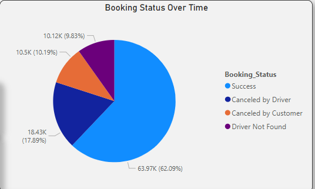

# 📊 Ola Mobility Data Analysis – Bengaluru City

## 📝 Introduction

Urban mobility is one of the defining challenges of the modern city, and ride-hailing platforms like **Ola** have transformed how people move in and around metropolitan areas. This project aims to uncover key insights from a simulated dataset based on Ola ride bookings in **Bengaluru**, India's tech capital and a city known for its complex traffic patterns and diverse commute behaviors.

The analysis applies data-driven methods to investigate user behavior, operational bottlenecks, service reliability, and satisfaction metrics—contributing toward smarter mobility solutions and better decision-making in the ride-hailing ecosystem.

---

## 📦 About the Data

The dataset used in this project is a **synthetic yet realistic representation** of Ola bookings in Bengaluru. It covers various aspects of mobility, customer behavior, and operational performance, allowing for a multi-faceted analysis of the ride-hailing landscape.

### Dataset Columns

1. **Date** – Booking date  
2. **Time** – Booking time  
3. **Booking ID** – Unique identifier per booking  
4. **Booking Status** – Success, Cancelled, or Incomplete  
5. **Customer ID** – Unique identifier per customer  
6. **Vehicle Type** – Categories include:  
   - Auto  
   - Prime Plus  
   - Prime Sedan  
   - Mini  
   - Bike  
   - eBike  
   - Prime SUV  
7. **Pickup Location** – 50 dummy areas from Bengaluru  
8. **Drop Location** – Selected from the same set of dummy areas  
9. **Avg VTAT** – Average vehicle time to arrive at vehicle  
10. **Avg CTAT** – Average customer time to arrive at vehicle  
11. **Cancelled Rides by Customer** – Binary count  
12. **Reason for Cancellation by Customer**:  
    - Driver not moving towards pickup  
    - Driver asked to cancel  
    - AC not working *(for 4-wheelers only)*  
    - Change of plans  
    - Wrong address  
13. **Cancelled Rides by Driver** – Binary count  
14. **Reason for Cancellation by Driver**:  
    - Personal/Car issues  
    - Customer-related issues  
    - Health/sick customer  
    - Over-capacity passengers  
15. **Incomplete Rides** – Binary indicator  
16. **Reason for Incomplete Ride**:  
    - Customer demand  
    - Vehicle breakdown  
    - Other issue  
17. **Booking Value** – Ride cost  
18. **Ride Distance** – Distance in km  
19. **Driver Ratings** – Rating given by customer (1-5)  
20. **Customer Rating** – Rating given by driver (1-5)

---

## 🎯 Aim of the Analysis

This project seeks to address the following core questions:

Following Questions were answered

1. Total Bookings and Booking Value    
2. Booking Value Per Vehicle Type    
3. Booking Status Over Time    
4. Revenue by Payment Method    
5. Average Customer Ratings by Vehicle Type    
6. Average Driver Ratings by Vehicle Type    
7. Cancelled Rides By Customer Reasons    
8. Cancelled Ride By Driver Reason    
